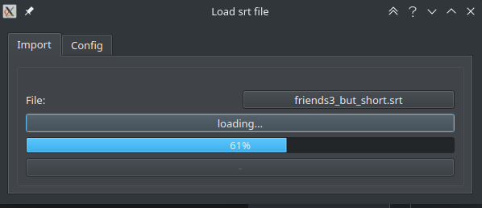
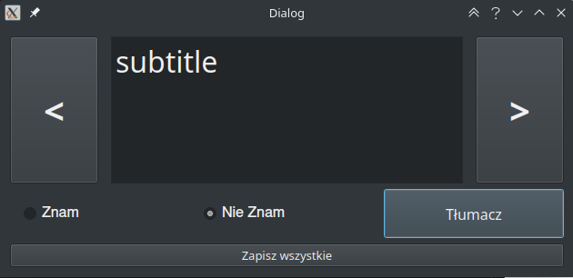
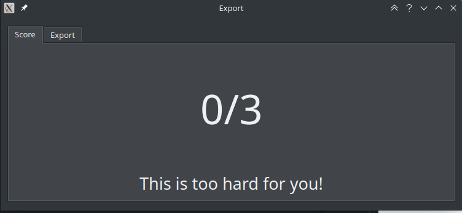
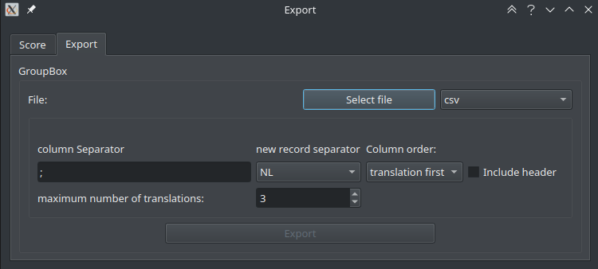

## Python-subtitles-translator
Application that helps you learn foreign language ( currently only English is supported). 

Main functionality of application is to generate flashcards based on movie subtitles and user's current knowledge.

### Data input

Application accepts movie subtitles given in *srt* format. User can also import currently known words using *csv*. Most flashcards learning programs have ability to export known words database in this format. 

### Data processing pipeline

 1. Subtitles file is processed line by line, all time-related.metadata are filtered out and sentences are split into words.
 2. Words from blacklist are filtered out.
 3. Basic form of word is obtained using various API.
 4. Word is translated.
 5. User has to decide what to do with words for which translation couldn't be found:
    * add them to black list
    * add translation manually
 6. words are added to database.
 7. Difficulty score is calculated.
 8. flashcards are ready to be exported.

 

 

### Export

Generated flashcards can be exported to CSV format:

 